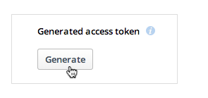

#rpi-rclone-dropbox

Use your Raspberry Pi to backup/sync your files to Dropbox unattended.  


</br>
###How to create a Dropbox app token  

(1) Create a new API App here https://www.dropbox.com/developers/apps/create  

(2) Click the button to generate a token



(3) Paste into **conf.txt**  

</br>
###Run it interactively to CLI


````
./run-interactively.sh
````
***OR***

````
docker run -it --rm=true \
	-v /mnt/Seagate/Dropbox:/home/pi/rclone/Dropbox \
	-v conf.txt:/root/.rclone.conf \
	ianscrivener/rpi-rclone-dropbox \
    rclone --transfers=1 -v copy /home/pi/rclone/Dropbox/Photos Dropbox:/Photo
	
````

###Run it as a daemon

````
./run-daemon.sh
````
***OR***

````
docker run -d \
    - t rpi-rclone-dropbox \
	-v /mnt/Seagate/Dropbox:/home/pi/rclone/Dropbox \
	-v conf.txt:/root/.rclone.conf \
	ianscrivener/rpi-rclone-dropbox \
    rclone --transfers=1 -v copy /home/pi/rclone/Dropbox/Photos Dropbox:/Photo
	
````


###Build it
````
./build.sh
````
***OR***

````
docker build --tag=my/rpi-rclone-dropbox .
	
````


###Thanks  
Standing on the shoulders of giants;

**[Nick Craig-Wood's](https://github.com/ncw)** excellent **rclone** utility written in Go - [rclone](http://rclone.org/) 

**[Hypriot's](http://http://blog.hypriot.com/)** Go Docker image for Raspberry Pi - [rpi-golang](https://hub.docker.com/r/hypriot/rpi-golang/)  


